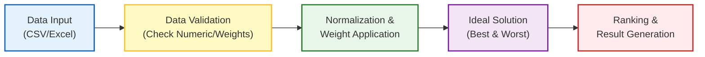
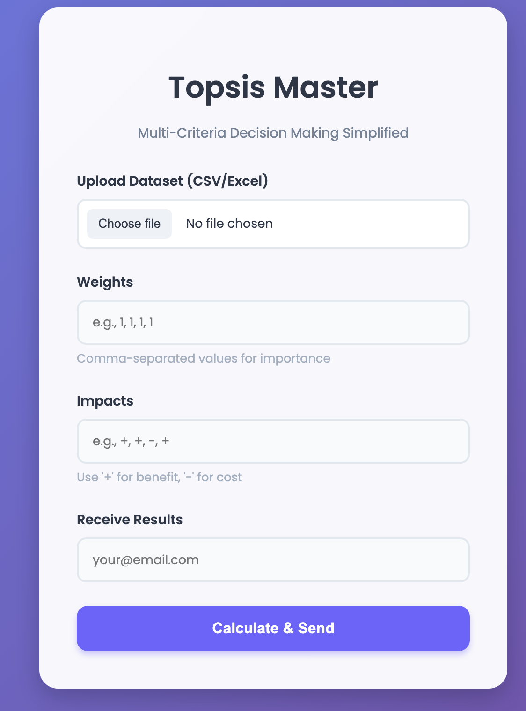

# TOPSIS-Vikas-102303451

[](https://pypi.org/project/Topsis-Vikas-102303451/)
[](https://www.python.org/downloads/)
[](https://opensource.org/licenses/MIT)

> **A Python package and Web Service for the Technique for Order of Preference by Similarity to Ideal Solution (TOPSIS).**

---

## 📋 Table of Contents
- [About TOPSIS](#-about-topsis)
- [System Flowchart](#-system-flowchart)
- [Installation](#-installation)
- [Usage (CLI & Python)](#-usage)
- [Web Application](#-web-application)
- [Mathematics Behind TOPSIS](#-mathematics-behind-topsis)
- [Project Structure](#-project-structure)
- [License](#-license)
- [Author](#-author)

---

## 🧠 About TOPSIS
**TOPSIS** is a multi-criteria decision analysis method. It is based on the concept that the chosen alternative should have the shortest geometric distance from the positive ideal solution (PIS) and the longest geometric distance from the negative ideal solution (NIS).

This project provides a complete suite to perform TOPSIS analysis:
1.  **Command Line Tool**: For quick, local analysis.
2.  **Python Package**:
    *   TOPSIS logic packaged and uploaded to PyPI
    *   Installable using pip
    *   Executable from the command line
    *   🔗 **PyPI Link**: [https://pypi.org/project/Topsis-Vikas-102303451/](https://pypi.org/project/Topsis-Vikas-102303451/)
3.  **Web Service**: A cloud-based interface for easy access.

---

## 🔄 System Flowchart



---

## 📦 Installation

Install the package directly from PyPI:

```bash
pip install Topsis-Vikas-102303451
```

---

## 💻 Usage

### 1. Command Line Interface (CLI)
You can calculate TOPSIS scores directly from your terminal.

**Syntax:**
```bash
topsis <InputDataFile> <Weights> <Impacts> <ResultFileName>
```

**Example:**
```bash
topsis data.csv "1,1,1,2" "+,+,+,+" result.csv
```

**Inputs:**
*   `InputDataFile`: CSV or Excel file containing the data matrix.
*   `Weights`: Comma-separated weights (e.g., `1,1,1,1`).
*   `Impacts`: Comma-separated impacts (`+` for beneficial, `-` for non-beneficial).
*   `ResultFileName`: Path to save the output file.

### 2. Python Library
Import the package in your Python scripts.

```python
from topsis_vikas import topsis

# topsis(input_file, weights, impacts, output_file)
topsis("data.csv", "1,1,1,1", "+,-,+,+", "output.xlsx")
```

---

## 🌐 Web Application

A live web service is deployed to provide a graphical user interface for TOPSIS.

**🔗 Live Link:** [https://topsis-vikas-102303451.vercel.app](https://topsis-vikas-102303451.vercel.app)

### ✨ Features
*   **Drag & Drop Interface**: Easily upload your `.csv` or `.xlsx` files.
*   **Auto-Analysis**: The system automatically detects the number of columns and suggests the required format for weights/impacts.
*   **Email Integration**: Get results delivered directly to your inbox.
*   **Secure**: Files are processed securely.

### 📸 Screenshot


---

## 🧮 Mathematics Behind TOPSIS

The TOPSIS process involves the following steps:

1.  **Create a Decision Matrix**:
    $X = [x_{ij}]_{m \times n}$ where $x_{ij}$ is the value of alternative $i$ for criterion $j$.

2.  **Normalize the Decision Matrix**:
    $r_{ij} = \frac{x_{ij}}{\sqrt{\sum_{i=1}^{m} x_{ij}^2}}$

3.  **Calculate Weighted Normalized Decision Matrix**:
    $v_{ij} = w_j \times r_{ij}$

4.  **Determine Ideal Best ($V^+$) and Ideal Worst ($V^-$) Solutions**:
    $V^+ = \{v_1^+, v_2^+, ..., v_n^+\}$, where $v_j^+ = \max(v_{ij})$ if impact is (+)
    $V^- = \{v_1^-, v_2^-, ..., v_n^-\}$, where $v_j^- = \min(v_{ij})$ if impact is (+)

5.  **Calculate Separation Measures (Euclidean Distance)**:
    $S_i^+ = \sqrt{\sum_{j=1}^{n} (v_{ij} - v_j^+)^2}$
    $S_i^- = \sqrt{\sum_{j=1}^{n} (v_{ij} - v_j^-)^2}$

6.  **Calculate Performance Score**:
    $P_i = \frac{S_i^-}{S_i^+ + S_i^-}$

7.  **Rank Alternatives**: Sort by $P_i$ in descending order.

---

## 📂 Project Structure

```bash
Topsis-Vikas-102303451
├── topsis_vikas/           # Source code for the package
│   ├── __init__.py
│   └── topsis.py
├── web_service/            # Codes for Web Service
│   ├── app.py              # Flask Application
│   ├── templates/          # HTML Templates
│   └── requirements.txt
├── setup.py                # Package configuration
├── README.md               # Project documentation
├── LICENSE                 # MIT License
└── data.csv                # Sample dataset
```

---

## 📜 License
This project is licensed under the MIT License - see the [LICENSE](LICENSE) file for details.

---

## 👨‍💻 Author

**Vikas Verma**
*   **Roll Number**: 102303451
*   **Institution**: Thapar Institute of Engineering & Technology
*   **Email**: vverma2_be22@thapar.edu
*   **GitHub**: [vikasverma](https://github.com/vikasverma9515)
